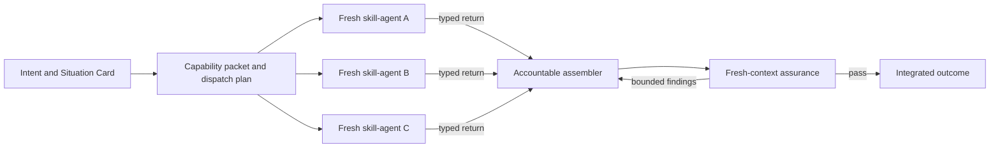

# Skill-Directed Agent Dispatch And Assembly

## Contents

- [Roles In The Harness](#roles-in-the-harness)
- [When To Dispatch](#when-to-dispatch)
- [Compile The Dispatch Plan](#compile-the-dispatch-plan)
- [Fresh-Context Node Contract](#fresh-context-node-contract)
- [Typed Worker Return](#typed-worker-return)
- [Assembly And Verification](#assembly-and-verification)
- [Authority Cost And Failure Controls](#authority-cost-and-failure-controls)
- [Hard Rules](#hard-rules)

## Roles In The Harness

Use these terms precisely:

- **Skill:** reusable decision and work contract for one capability. It is not a running agent.
- **Harness orchestrator:** compiles the task graph, authorizes dispatch, enforces budgets, and names the assembler.
- **Fresh-context agent:** one bounded execution instance using a selected skill and scoped context.
- **Assembler:** accountable fan-in owner that resolves conflicts and integrates accepted outputs.
- **Assurance agent:** fresh-context, preferably read-only reviewer that verifies the assembled result against intent and evidence.

A selected skill may request another bounded worker, but it must return that request to the root harness. Do not let specialist agents recursively create an uncontrolled workforce.

## When To Dispatch

Use skill-directed agents when a meaningful job has at least one of these properties:

- Independent research, review, or design branches benefit from fresh context.
- Several specialist domains must contribute without contaminating each other's judgment.
- Work can be divided into disjoint write scopes or read-only artifacts.
- Conditional findings route to different specialist paths.
- Context breadth would make one conversation unreliable.

Keep one loop for small sequential work with one continuous context, one write owner, or orchestration cost larger than the task. A capability packet does not require one agent per selected skill.

## Compile The Dispatch Plan

1. Establish intent, prohibited outcomes, situation, authority, and verification oracle.
2. Select the smallest capability packet.
3. Convert only independent, permission-separated, or context-isolated responsibilities into nodes.
4. Draw typed edges before dispatch.
5. Give every node one job, fresh context, typed inputs, explicit exclusions, minimum tools, bounded write scope, output schema, budget, and failure result.
6. Name one assembler before any worker starts.
7. Dispatch only within the user, system, repository, and tool authority available.
8. Collect typed returns; reject unsupported self-reports.
9. Assemble by precedence and verify the integrated whole in a fresh context.



## Fresh-Context Node Contract

```yaml
node:
  id: "<stable node id>"
  skill: "<selected skill>"
  purpose: "<one bounded job>"
  context_mode: fresh
  reads: []
  source_refs: []
  context_excludes: []
  memory_scope: "<role and project facts only>"
  tools: []
  write_scope: []
  returns: "<typed output schema>"
  success_evidence: []
  failure_output: "<typed failure>"
  limits:
    attempts: 1
    time: "<cap>"
    token_or_cost: "<cap>"
  may_request_workers: false
```

Set `may_request_workers: true` only for a named orchestrator node with a remaining shared budget and explicit maximum depth and width. A worker request is a proposal to the harness, not immediate spawn authority.

For code changes, assign disjoint files, modules, or isolated worktrees. Otherwise make workers return findings, plans, tests, or patches for the assembler rather than editing shared files concurrently.

## Typed Worker Return

Require every agent to return:

```yaml
worker_return:
  node_id: "<node id>"
  status: "complete | partial | failed | needs_intent | blocked"
  artifact_refs: []
  findings: []
  evidence: []
  assumptions: []
  conflicts: []
  risks: []
  requested_followup: "<none or bounded request>"
```

Do not accept "done," confidence, or prose summaries as verification. Preserve sources and distinguish observed facts from interpretation.

## Assembly And Verification

Assembly is not concatenation. The assembler must:

1. Apply precedence: user intent and prohibitions; authority and safety; accepted architecture and sources of truth; node-specific findings; optional polish.
2. Resolve duplicate or conflicting outputs explicitly.
3. Reject work outside node scope or unsupported by evidence.
4. Integrate through one write owner per artifact.
5. Run relevant tests and direct artifact inspection after integration.
6. Route the assembled result to a fresh-context assurance agent with the requirement source and actual artifacts, not producer reasoning.
7. Record unresolved risks and require named human gates before consequential transitions.

The executive graph has two assembly levels:

- CEO assembles independent market and optional Weirdo inputs into `direction_decision`.
- The job-level software steward or named domain lead assembles specialist worker outputs into the product artifact. COO owns work flow, not automatic code merge authority.

## Authority Cost And Failure Controls

- Cap total nodes, concurrency, delegation depth, cost, and wall-clock time.
- Cancel downstream nodes when an upstream intent, authority, or safety requirement fails.
- Retry only isolated retryable nodes; preserve successful expensive outputs by reference.
- Group clarification and approval needs rather than interrupting the owner per node.
- Never let a child agent inherit more tools, data, or initiative than the parent job.
- Compare the graph against a single-context or staged-loop baseline.
- Remove nodes that do not improve quality, diversity, speed, isolation, or control.

## Hard Rules

- Do not equate a selected skill with a required agent.
- Do not let skills spawn agents outside root harness authority and shared budgets.
- Do not share accumulating hidden reasoning between agents intended to be independent.
- Do not let parallel workers write the same artifact.
- Do not assemble by averaging, voting, or concatenating incompatible outputs.
- Do not let the assembler self-verify when an independent assurance context is warranted.
- Do not present a dispatch plan as executed work; inspect actual returns and integrated artifacts.
