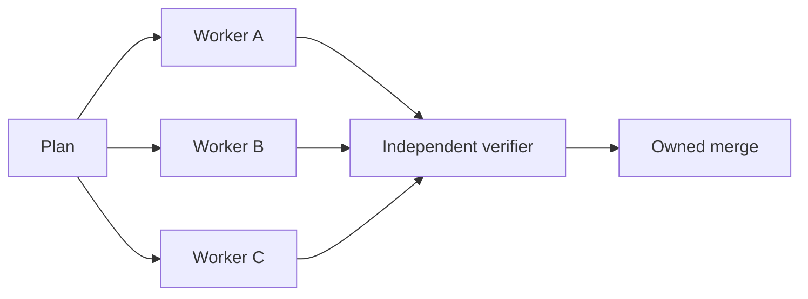
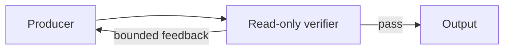
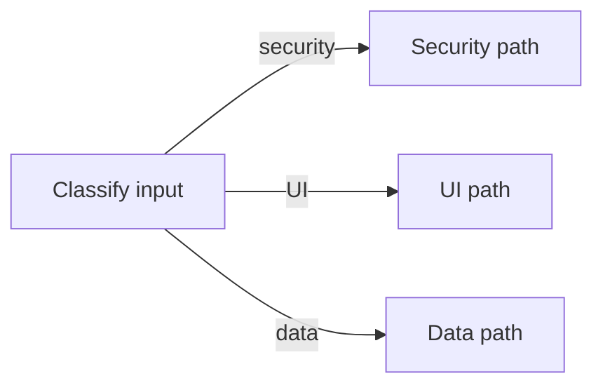

# Task Graphs

## Contents

- [Evidence-based selector](#evidence-based-selector)
- [Core topologies](#core-topologies)
- [Typed contracts](#typed-contracts)
- [Context isolation and cognitive independence](#context-isolation-and-cognitive-independence)
- [State and mutation](#state-and-mutation)
- [Verification and merge ownership](#verification-and-merge-ownership)
- [Failure and cost controls](#failure-and-cost-controls)
- [Primary sources](#primary-sources)

## Evidence-Based Selector

Google Research evaluated 180 agent configurations and found that centralized multi-agent coordination substantially improved parallelizable financial reasoning but degraded sequential planning across every tested multi-agent design. Tool-heavy coordination also imposed increasing overhead. Treat decomposability and tool density as routing inputs, not "more agents is better" as a default.

Anthropic reports that parallel agents work best for breadth-first research with independent directions and large context requirements. It also reports much higher token use and warns that many coding tasks contain fewer truly parallel branches than research.

Choose:

| Work shape | Smallest suitable structure |
|---|---|
| One continuous context, sequential dependencies | Single loop |
| Fixed sequence with objective gates | Chain |
| Independent read-only or disjoint-scope tasks | Fan-out/fan-in |
| Distinct input categories | Router |
| Clear rubric and improvement loop | One staged loop with a separate verifier |
| Unknown subtasks discovered during execution | Central orchestrator -> scoped workers -> synthesize |
| Strict legal transitions or durable recovery | Explicit state graph/runtime |

## Core Topologies

### Diamond

Use only when workers do not need each other's results and have disjoint write scopes or return read-only findings.

### Evaluator Loop

Require a measurable rubric, a maximum number of rounds, and an escalation path after the cap.

### Router

Use deterministic classification when rules are reliable. Use an agentic router only when categories require judgment.

## Typed Contracts

Define nodes with this minimum contract:

| Field | Meaning |
|---|---|
| `id` | Stable node name |
| `purpose` | One job only |
| `reads` | Inputs and source artifacts |
| `context_excludes` | Histories, conclusions, or memory intentionally withheld to preserve independence |
| `memory_scope` | Durable facts this node may retrieve |
| `writes` | Exclusive artifact or state fields |
| `returns` | Typed output schema |
| `tools` | Minimum required capabilities |
| `success` | Observable completion evidence |
| `failure` | Typed failure result and retryability |
| `limits` | Timeout, attempts, token/cost cap |

Use edge types with operational meaning:

- `depends_on`: target cannot start without source output.
- `produces`: source creates an artifact consumed downstream.
- `routes_on`: condition selects a legal next node.
- `verifies`: source evaluates target output against a rubric.
- `blocks`: source failure prevents target execution.
- `retries`: verifier feedback returns to a producer.
- `requires_approval`: transition needs explicit human authority.
- `supersedes`: newer plan, decision, or artifact replaces an older one.

## Context Isolation And Cognitive Independence

Use separate fresh contexts when a node exists to contribute a genuinely different perspective, judgment domain, or independent verification. Fresh context means:

- A separate conversation or agent session, even if the underlying model is the same.
- The smallest source-backed evidence packet required for the node's job.
- Role-scoped memory and tools.
- A typed output artifact rather than inherited hidden reasoning.
- Explicit `context_excludes` that prevent anchoring on another node's preferred conclusion.

Fresh context is not empty context. Do not withhold requirements, safety constraints, source evidence, or the accepted decision a downstream node must implement. Withhold irrelevant transcript history, brainstorm residue, producer self-justification, and conclusions the node is meant to assess independently.

When one agent performs several named roles in one accumulating context, label the result `degraded_single_context`. Do not count it as independent multi-agent evidence. Compare the fresh-context graph with this cheaper baseline on decision quality, diversity, correction rate, cost, and wall-clock time.

## State And Mutation

Keep execution state smaller than the artifacts it references. Store pointers, hashes, statuses, and decisions rather than copying entire reports into shared state.

For every state field define:

- Type and valid values.
- Single writer or merge rule.
- Source of truth.
- Persistence and resume behavior.
- Redaction and sensitivity.
- Expiry or supersession rule.

Use one writer per file or mutable external resource. Parallel workers should return findings or edit disjoint worktrees/files. Never assume concurrent model outputs merge cleanly.

## Verification And Merge Ownership

The verifier should be separate from the producer when independence materially improves trust. Give it read-only access where possible, the actual requirements, the changed artifact or diff, and concrete acceptance criteria.

One coordinator owns the final synthesis. It must:

1. Resolve conflicting findings explicitly.
2. Reject unsupported conclusions.
3. Verify the integrated result against the environment.
4. Record unresolved risks.
5. Route irreversible transitions through the human gate.

## Failure And Cost Controls

- Cap parallel width and total spawned work.
- Cap every feedback loop and recursive delegation path.
- Retry only the failed node when its output is isolated.
- Cancel downstream nodes when an upstream requirement fails.
- Preserve enough state to resume without replaying successful expensive work.
- Measure cost per successful completion, not cost per agent call.
- Compare against a single-loop baseline before retaining the graph.
- Remove nodes and edges that do not improve quality, latency, isolation, or control.

## Primary Sources

- Google Research, "Towards a science of scaling agent systems: When and why agent systems work" (2026): https://research.google/blog/towards-a-science-of-scaling-agent-systems-when-and-why-agent-systems-work/
- Anthropic, "How we built our multi-agent research system" (2025): https://www.anthropic.com/engineering/multi-agent-research-system
- Anthropic, "Building Effective AI Agents" (2024): https://www.anthropic.com/engineering/building-effective-agents
- LangGraph official overview: https://docs.langchain.com/oss/python/langgraph/overview
- Microsoft AutoGen GraphFlow documentation: https://microsoft.github.io/autogen/dev/user-guide/agentchat-user-guide/graph-flow.html
- Google Agent Development Kit workflow documentation: https://adk.dev/agents/workflow-agents/
