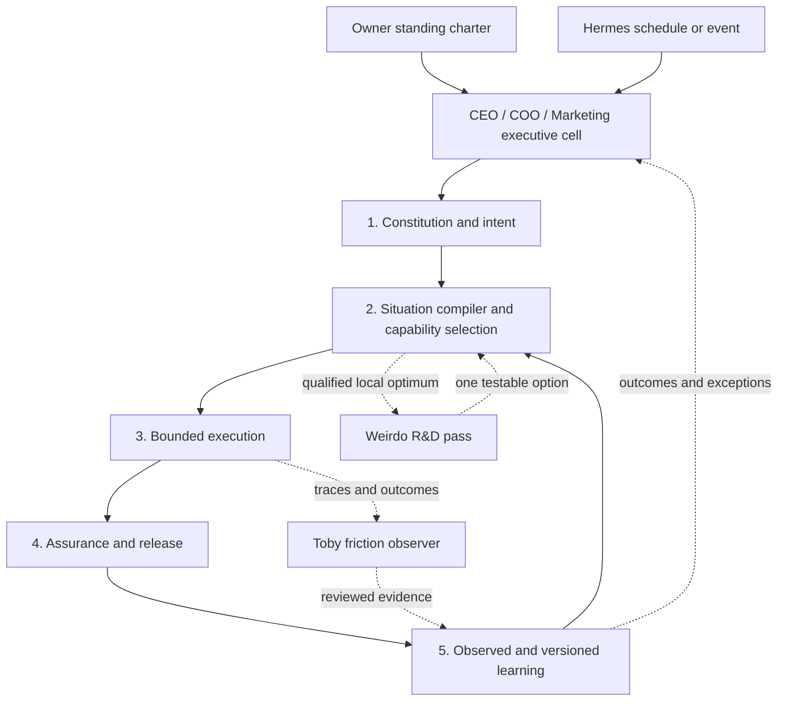

# Agentic Software Harness

## Contents

- [Identity And Current Boundary](#identity-and-current-boundary)
- [Five-Layer Architecture](#five-layer-architecture)
- [Harness Job Contract](#harness-job-contract)
- [Task-Specific Capability Packets](#task-specific-capability-packets)
- [Skill-Directed Dispatch And Assembly](#skill-directed-dispatch-and-assembly)
- [Executive Direction And Activation](#executive-direction-and-activation)
- [Research And Learning Roles](#research-and-learning-roles)
- [Runtime Graduation Gates](#runtime-graduation-gates)
- [Measures And Hard Rules](#measures-and-hard-rules)

## Identity And Current Boundary

Keep **Agentic Software Steward** as the product and lead-agent identity. Use **Agentic Software Harness** for the underlying architecture that turns intention into bounded, verified, learnable software work.

The current implementation is a skill-based instruction harness. It provides routing, contracts, safety boundaries, review, verification, and learning specifications. It is not yet a durable software-factory runtime: it does not itself provide persistent jobs, queues, worker isolation, artifact lineage, scheduling, recovery, or production execution telemetry.

Treat "software factory" as an outcome claim earned by repeatable delivery evidence, not as a name granted by a diagram or collection of agent roles.



## Five-Layer Architecture

| Layer | Owns | Current components | Must not become |
|---|---|---|---|
| 1. Constitution and intent | Actor, outcome, success evidence, prohibited outcomes, human authority, durable purpose constraints | Intent contract, product memory, purpose protocol when qualified | A vague mission statement or permission shortcut |
| 2. Situation compiler and capability selection | Risk, reversibility, uncertainty, work shape, architecture mode, method, topology, specialists, overlays, gates | Situation Card, steward routing, automation/graph/exponential qualification | A universal mega-prompt or opaque automatic planner |
| 3. Bounded execution | Smallest real vertical slice, explicit tools, write ownership, budgets, retries, stop conditions | Lean/senior architecture and specialist workflows | An unbounded agent workforce or assumed runtime |
| 4. Assurance and release | Intent review, verification, audience boundaries, security, environment safety, rollback, release truth | Review, evidence, audience, security, live-environment, no-theater, release skills | A ceremonial checklist or worker self-approval |
| 5. Observed and versioned learning | Outcomes, corrections, friction, eval cases, stable rules, durable project memory | Toby pattern, OB1/OpenBrain handoffs, validation scenarios, project memory | Unreviewed prompt mutation or autonomous policy change |

Every meaningful software job should pass through these layers proportionally. A tiny reversible change may resolve them in one short loop; a critical migration may require explicit artifacts, gates, and independent review.

## Harness Job Contract

Use this as a working intermediate representation, not mandatory permanent paperwork:

```yaml
harness_job:
  intent:
    actor: "<who benefits or operates it>"
    outcome: "<observable job>"
    success_evidence: []
    prohibited_outcomes: []
  situation:
    mode: "lean | standard | senior"
    risk: "low | medium | high | critical"
    topology: "direct | staged_loop | task_graph | durable_graph"
  capability_packet:
    selected_specialists: []
    mandatory_overlays: []
    intentionally_excluded: []
  dispatch:
    mode: "direct | staged_loop | skill_directed_graph"
    node_refs: []
    assembler: "<one accountable owner>"
    assurance_context: "same | fresh"
  execution:
    vertical_slice: "<smallest real outcome>"
    initiative_ceiling: "observe | suggest | draft | execute_reversible | execute_gated"
    human_gates: []
    stop_conditions: []
  assurance:
    verification: []
    rollback: "<mechanism or not applicable>"
  learning:
    outcome_signals: []
    friction_observation: "none | candidate | active"
```

Persist only facts future contributors or runs need. Do not create a harness-job document for trivial work.

## Task-Specific Capability Packets

Treat the capability packet as an ephemeral routing decision first. It identifies the smallest relevant set of specialist contracts after the Situation Card is known.

- Keep explicit standalone specialist use available when the user requests it.
- Select skills and overlays; do not concatenate the entire library into a generated mega-prompt.
- Include the reason each specialist was selected and suppress irrelevant specialists silently.
- Force-include security, authority, audience, live-environment, review, or completion-evidence overlays when the situation requires them. Context savings cannot remove a safety invariant.
- Keep capability selection separate from execution authority.
- Benchmark manual packets against the current discoverable catalog before building a compiler, registry, or packet format.

A packet selector is justified only when behavioral evaluation shows that it improves routing precision, outcome quality, context cost, clarification burden, or safety without creating missed-specialist failures.

## Skill-Directed Dispatch And Assembly

Read [the skill-directed agent assembly contract](../../graph-engineering/references/skill-directed-agent-assembly.md) when a meaningful capability packet contains independent specialist work.

Treat skills as node contracts. Let the root harness compile a bounded task graph and dispatch separate fresh-context agents for the nodes that earn independence. Require typed returns and disjoint write scopes, then give one named assembler responsibility for integration. Route the integrated result through fresh-context assurance before completion or release.

Do not make every selected skill a running agent. Keep sequential, tiny, or shared-context work in one loop, and keep all child dispatch within root budgets and authority.

## Executive Direction And Activation

Read [executive-operating-loop.md](executive-operating-loop.md) when the user wants CEO, COO, Marketing, chief-of-staff, portfolio, or other proactive agents to initiate work through Hermes.

Keep the executive cell above the five execution layers. Run CEO, COO, and Marketing as separate fresh-context agents, not one agent changing hats. Marketing returns an independent market brief; CEO owns strategic synthesis and direction; COO receives the accepted decision in a new context and converts it into bounded harness jobs. Hermes wakes approved loops, while an accepted standing autonomy charter supplies goals, action ceilings, budgets, escalation rules, and decisions that remain human.

Do not require the owner to initiate every internal observation, analysis, or draft after the charter is accepted. Do require a fresh gate when work falls outside the charter or crosses a named consequential boundary.

## Research And Learning Roles

Use two bounded roles around the ordinary production path:

- **Weirdo Pass / R&D:** after intent and a credible baseline, generate one non-obvious, causal, reversible option. It is read-only and cannot merge or execute its proposal.
- **Toby pattern / process observer:** collect source-backed retries, corrections, escalations, access gaps, and handoff friction. It may propose an eval, rule, or workflow change but cannot apply it.

Route change through:

```text
hypothesis -> reversible pilot -> evidence -> accountable review -> versioned change -> fresh verification
```

Do not let either role self-modify prompts, policies, permissions, skills, routing, or production behavior.

## Runtime Graduation Gates

Keep the harness skill-based until real work proves that current primitives cannot provide required execution behavior. Before adding a durable job runner, queue, agent registry, event bus, control plane, graph database, or worker service, require:

- A named repeated workflow and accountable owner.
- Baseline outcome, cost, latency, failure, and human-intervention evidence.
- A proven need for waiting, resume, partial retry, isolation, concurrency, scheduling, or artifact lineage.
- Explicit data, permission, external-effect, and rollback boundaries.
- A simpler implementation that has been tried or honestly ruled out.
- A reversible pilot with success and stop criteria.
- Operational ownership for monitoring, incident response, cost, and retirement.

Graduate one proven workflow, not the entire suite. Do not build a general factory runtime because the skill model resembles a factory.

## Measures And Hard Rules

Measure the harness by:

- Intent and requirement accuracy.
- Time to the first working vertical slice.
- Routing precision and unnecessary specialist activation.
- Safety, audience, and authority violations.
- Verification quality and escaped defects.
- Clarification turns, retries, human interventions, cost, and wall-clock time.
- Whether reviewed learning improves later comparable work.

Hard rules:

- Do not present named roles, skills, schemas, scenarios, or dashboards as running agents or shipped factory capability.
- Do not optimize context by omitting required safety or assurance overlays.
- Do not let capability selection grant tool, write, scheduling, or external-action authority.
- Do not let observation or evaluation mutate production behavior without versioned review and rollback.
- Do not centralize every task in the harness; direct deterministic work should remain direct.
- Do not build factory infrastructure until one repeated workflow proves the need and benefit.
