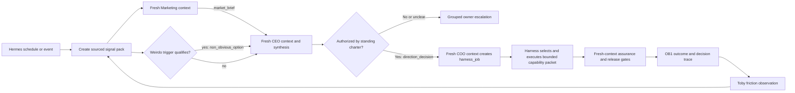

# Executive Operating Loop

## Contents

- [Purpose And Boundary](#purpose-and-boundary)
- [Executive Cell](#executive-cell)
- [Fresh-Context Contract](#fresh-context-contract)
- [Standing Autonomy Charter](#standing-autonomy-charter)
- [Proactive Operating Loop](#proactive-operating-loop)
- [Hermes And OB1 Responsibilities](#hermes-and-ob1-responsibilities)
- [Work Lifecycle](#work-lifecycle)
- [Default Authority Boundaries](#default-authority-boundaries)
- [Proof Before Scale](#proof-before-scale)

## Purpose And Boundary

Use the executive cell to turn standing goals and new signals into prioritized, bounded harness jobs without requiring the owner to initiate every internal analysis or draft.

This cell is an optional decomposition above the Agentic Software Harness. An owner-facing partner may combine CEO and COO responsibilities; create separate fresh contexts only when independent judgment or bounded execution needs them. Do not present one accumulating conversation as multiple independent reviewers:

- The executive cell decides what deserves attention within delegated authority.
- The harness decides how to perform and verify each accepted job.
- Hermes activates scheduled or event-driven reviews and resumes eligible work.
- OB1/OpenBrain preserves sourced goals, decisions, opportunities, and outcomes.
- The human owner retains purpose, capital, identity, and consequential authority defined in the charter.

Do not create agents merely to imitate an executive org chart. Roles earn separation through distinct inputs, outputs, decision rights, memory scopes, and evaluation criteria. When an executive graph is selected, fresh context protects independence. For owner-partner, business-lead, and messaging-topic arrangements, follow [Shared Agent Workspace](shared-agent-workspace.md).

## Executive Cell

### CEO Agent: Direction And Portfolio Judgment

Own:

- Refine raw ideas into intent, assumptions, value, evidence, and smallest proof.
- Compare opportunities against standing goals, constraints, capacity, and opportunity cost.
- Select or recommend a small priority set and name what should wait or stop.
- Invoke a bounded Weirdo Pass when a credible baseline may be a local optimum.

Return a `direction_decision` with rationale, evidence, confidence, unresolved intent, and authority basis. Do not dispatch work, spend money, publish, or change product commitments outside the charter.

Receive the standing goals, charter, source-backed signal pack, independent Marketing brief, and optional Weirdo option. Do not inherit the Marketing or COO agent's hidden reasoning or full conversation history. The CEO owns strategic synthesis.

### COO Agent: Work Conversion And Flow

Own:

- Turn an authorized direction into a `harness_job` with outcome, capability packet, initiative ceiling, budgets, gates, stop conditions, and verification.
- Start eligible internal jobs, track state, reconcile blockers, and group escalations.
- Ensure completed work passes assurance and that abandoned work is retired honestly.
- Use Toby observations to improve the operating process through reviewed changes.

The COO coordinates; it does not overrule the CEO's direction, the owner's charter, specialist safety rules, or release authority.

Receive the accepted `direction_decision`, charter rule, capacity/work-state summary, and harness contracts. Do not inherit open ideation, raw brainstorming, or the CEO's private chain of reasoning. The COO owns work conversion and flow synthesis.

For multi-domain jobs, have the COO request a root harness dispatch plan using [skill-directed agent assembly](../../graph-engineering/references/skill-directed-agent-assembly.md). The job-level software steward or named domain lead remains the assembler; COO flow ownership does not imply code-merge or self-verification authority.

### Marketing Agent: Market Sense And Experiment Design

Own:

- Monitor scoped market, customer, competitor, content, campaign, and product signals.
- Turn evidence into positioning hypotheses, audience questions, campaign concepts, and measurable experiments.
- Route visible words through product/brand truth, `brand-copy-steward`, the direct-response engine when appropriate, `ai-writing-audit`, and `audience-boundary`.
- Compare experiment outcomes without inventing attribution or declaring weak signals causal.

Default to research, suggestions, and drafts. Publishing, outreach, list changes, ad spend, pricing, offers, customer promises, and brand repositioning require the charter's named gate. The gate may be per-action human authority or a versioned deterministic policy envelope; an active policy can authorize routine qualifying instances while exceptions stop.

Receive scoped market/customer sources, product and brand truth, active goals, and prior outcome summaries. Do not receive a preferred CEO conclusion before producing the independent `market_brief`. The Marketing agent owns market evidence, not portfolio priority or release.

## Fresh-Context Contract

Run CEO, COO, and Marketing as distinct agent sessions or subagents. They may use the same underlying model, but must not share an accumulating conversational history.

```yaml
context_contract:
  agent_role: "ceo | coo | marketing | weirdo | assurance | toby"
  work_item: "<stable key>"
  receives: []
  source_refs: []
  excludes: []
  memory_scope: "<role-scoped durable facts>"
  tools: []
  write_scope: []
  returns: "<typed artifact>"
  expires_after: "<job, decision, or review boundary>"
```

Use fresh context to remove anchoring and role contamination, not to remove evidence. Each agent receives the smallest source-backed packet required for its decision and returns a typed artifact:

| Agent | Primary input | Typed output | Accountable synthesis |
|---|---|---|---|
| Marketing | Scoped market/customer evidence and product truth | `market_brief` | Marketing owns evidence quality |
| Weirdo, conditional | Intent, credible baseline, evidence, constraints | `non_obvious_option` | CEO accepts, tests, parks, or rejects |
| CEO | Charter, goals, signal pack, `market_brief`, optional `non_obvious_option` | `direction_decision` | CEO owns portfolio judgment |
| COO | Accepted `direction_decision`, capacity, work state, harness contracts | `harness_job` | COO owns work conversion and flow |
| Assurance | Intent, requirements, changed artifacts, verification criteria | `assurance_result` | Release owner owns final transition |
| Toby | Versioned traces, outcomes, corrections, and interventions | `workflow_friction_observation` | Human-reviewed learning path owns changes |

Pass source pointers, decisions, and typed outputs through OB1/OpenBrain or job state. Do not pass raw private reasoning, entire chat histories, or unrestricted global memory between agents.

If the environment cannot provide separate contexts, label the run `degraded_single_context`. It may be used for a cheap draft, but it is not equivalent evidence for the executive graph and must not be presented as independent CEO/COO/Marketing judgment.

## Standing Autonomy Charter

Require an accepted charter before proactive work can move beyond suggestions:

```yaml
executive_charter:
  owner: "<human authority>"
  purpose: "<durable direction>"
  active_goals: []
  priority_rules: []
  prohibited_outcomes: []
  sources_of_truth: []
  data_scopes: []
  role_authority:
    ceo:
      initiative_ceiling: "suggest | draft | execute_reversible"
      may_start_job_types: []
    coo:
      initiative_ceiling: "suggest | draft | execute_reversible"
      may_start_job_types: []
    marketing:
      initiative_ceiling: "observe | suggest | draft | execute_reversible | execute_gated"
      may_start_job_types: []
  budgets:
    time: "<cap>"
    model_or_tool_cost: "<cap>"
    concurrent_jobs: "<cap>"
  policy_delegated_effects:
    - action_class: "<for example one-to-one commercial email>"
      status: "draft | shadow | active | paused | revoked | expired"
      policy_version: "<immutable version>"
      eligibility_rules: []
      deterministic_gates: []
      assurance_threshold: "<required independent result>"
      volume_or_cost_caps: []
      sampled_oversight: "<sample rule and digest>"
      automatic_pause_thresholds: []
      kill_switch: "<owner-visible revocation path>"
      exception_owner: "<named human role>"
  always_human_decisions: []
  escalation_triggers: []
  review_cadence: "<cadence>"
  quiet_hours: "<optional>"
  stop_conditions: []
  expires_or_review_at: "<date or trigger>"
```

Treat missing or conflicting intent that would change goals, scope, authority, product identity, data use, or consequential action as an escalation. Do not stop for implementation choices the harness can derive safely.

After the charter and Hermes schedule are explicitly accepted, eligible runs may
proceed without new per-run approval. A consequential instance may commit
without per-action human review only when an active `policy_delegated_effect`
explicitly covers it and every immediate deterministic and assurance gate
passes. This standing permission ends at the charter's scope, initiative
ceiling, budget, expiry, stop conditions, and consequential gates.

## Proactive Operating Loop



Internal observation, analysis, prioritization, research, and drafting may begin
automatically when the charter permits them. Repository writes may begin as
bounded reversible jobs when the charter names the job class, isolation method,
verification, cost cap, and release gate. Never infer permission to merge,
deploy, publish, contact people, spend, delete, or change permissions from
permission to start an internal job. Those effects require their own named
human gate or active policy-delegated effect.

Typed edges are `produces market_brief`, `produces non_obvious_option`, `produces direction_decision`, `routes_on charter_authority`, `produces harness_job`, `verifies execution`, and `produces workflow_friction_observation`. One owner synthesizes each fan-in; no downstream agent receives upstream hidden reasoning.

## Hermes And OB1 Responsibilities

Use Hermes for:

- Approved schedules, event triggers, resumable activation, and concise grouped notifications.
- Stable suggestion or job keys, deduplication, quiet hours, expiry, and cancellation.
- Waking the correct executive or harness entry point with the smallest required context reference.

Use OB1/OpenBrain for:

- Sourced goals, charter references, decisions, qualified opportunities, outcome evidence, and friction summaries. Runtime/job systems own work-item state; connected business systems own approvals and records.
- Source pointers and observation times rather than copied private source content.
- Deduplicated records linked to project and workflow identity.

Do not use Hermes as strategic authority or OB1 as a dumping ground for every trace. The repository and connected business systems remain sources of truth for their own state.

## Work Lifecycle

Use a durable `executive_work_item` when a signal survives initial triage:

```yaml
kind: executive_work_item
schema_version: 1
key: "executive:<scope-id>:<normalized-work-id>"
status: "detected | refining | proposed | charter_authorized | active | waiting_gate | verified | learned | dismissed | retired"
goal_refs: []
source_signals: []
owner_role: "ceo | coo | marketing"
direction: "<intended outcome>"
authority_basis: "<charter version and rule>"
initiative_ceiling: "observe | suggest | draft | execute_reversible | execute_gated"
harness_job_ref: "<optional>"
human_gate: "<optional>"
next_trigger: "<schedule, event, evidence, or decision>"
expires_at: "<optional>"
```

Update by stable key rather than creating parallel tasks for the same opportunity. Dismissed or retired work stays quiet until materially new evidence appears.

## Default Authority Boundaries

Without a more permissive accepted charter:

- CEO: observe, refine, compare, suggest, and draft decision briefs.
- COO: draft harness jobs, start read-only internal jobs, and track work.
- Marketing: observe, research, suggest, and draft private experiments or copy.
- Hermes: activate approved scans and surface suggestions; do not create schedules from conversation alone.

Require a named gate for external messages, public content, spend, pricing,
offers, contracts, purchases, deployments, merges, deletion, credentials,
permissions, customer-data movement, or irreversible actions. A gate may be an
explicit human decision or an accepted deterministic policy for a tightly
defined repeated action class. Policy-authorized execution requires immediate
eligibility and suppression checks, idempotency, independent assurance,
provider reconciliation, sampled oversight, automatic pause thresholds, and a
rapid kill switch. Missing, stale, failed, or ambiguous checks route the
instance to the owner. Allow bounded repository writes only through an
explicitly delegated isolated-work job with verification and no automatic
release.

## Proof Before Scale

Prove one executive loop before creating a fleet:

1. Choose one recurring input, such as a weekly product-and-market review.
2. Accept a narrow charter and schedule.
3. Run CEO refinement, one COO-created internal harness job, and one Marketing evidence contribution.
4. Measure useful decisions, owner interruptions, duplicate suggestions, completed verified work, cost, and safety events.
5. Review Toby friction and revise the charter or routing manually.
6. Add durable graph/runtime infrastructure only when waiting, recovery, concurrency, or scale exceeds Hermes plus existing records.

Stop or narrow the loop when it creates low-value activity, repeated clarification, strategy drift, duplicate work, unverifiable recommendations, excess cost, or any authority violation.
